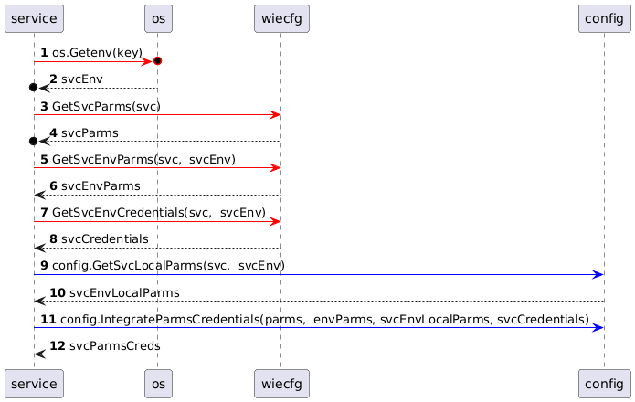

# Introduction
WIE microservices depend on configuration parameters and credentials, all linked one of its four environments:
-  development: where the software engineer builds the software;
-  test: Cloud based, used to test integrated development versions;
-  staging: Cloud based, production replica, except for data;
-  production: Cloud based, where actors use the ERP;

WIE has one configuration parameter file for each microservice that applies to all its environments:
- <<service name>>.yaml file shared by all environments

Each microservice has two configuration parameters that apply each of their environments:
- <<service name>>.<<environment name>>.parms.yaml: specific to the environment;
- <<service name>>.<<environment name>>.parms.local.yaml: specific to a particular execuon in the environment;

Each microservice new credential that apply to each of their environments:
- <<service name>>.<<environment name>>.credentials: specific to the environment;

Note the the microservices credentials are separate from their configuration parameters. Initially they will be kept in MY secret vault and I'll not check them in the repository; `TODO`: integrate vault service to serve microservices credentials;   

# Loading order
The table below depicts the order of loading these files:
<table style="width: 100%; border-collapse: collapse;">
  <thead>
    <tr style="background-color: #010101;">
       <th rowspan="2" style="border: 1px solid #ddd; padding: 8px;">Order</th>
       <th colspan="3" style="border: 1px solid #ddd; padding: 8px;">Environment</th>
      <th rowspan="2" style="border: 1px solid #ddd; padding: 8px;">.gitignore</th>
      <th rowspan="2" style="border: 1px solid #ddd; padding: 8px;">Notes</th>
    </tr>
    <tr style="background-color: #090909;">
      <th style="border: 1px solid #ddd; padding: 8px; text-align: left;">development</th>
      <th style="border: 1px solid #ddd; padding: 8px; text-align: left;">test</th>
      <th style="border: 1px solid #ddd; padding: 8px; text-align: left;">stage</th>
      <th style="border: 1px solid #ddd; padding: 8px; text-align: left;">production</th>
    </tr>
  </thead>
  <tbody>
    <tr>
      <td style="border: 1px solid #ddd; padding: 8px;">1</td>
      <td style="border: 1px solid #ddd; padding: 8px; text-align: left;">.env</td>
      <td style="border: 1px solid #ddd; padding: 8px; text-align: left;">.env</td>
      <td style="border: 1px solid #ddd; padding: 8px; text-align: left;">.env</td>
      <td style="border: 1px solid #ddd; padding: 8px; text-align: left;">.env</td>
      <td style="border: 1px solid #ddd; padding: 8px; text-align: left;">NO</td>
	    <td style="border: 1px solid #ddd; padding: 8px; text-align: left;">Shared for all environments</td>
    </tr>
    <tr>
      <td style="border: 1px solid #ddd; padding: 8px;">2</td>
      <td style="border: 1px solid #ddd; padding: 8px; text-align: left;">.env.development</td>
      <td style="border: 1px solid #ddd; padding: 8px; text-align: left;">.env.test</td>
      <td style="border: 1px solid #ddd; padding: 8px; text-align: left;">.env.stage</td>
      <td style="border: 1px solid #ddd; padding: 8px; text-align: left;">.env.production</td>
      <td style="border: 1px solid #ddd; padding: 8px; text-align: left;">NO</td>
	    <td style="border: 1px solid #ddd; padding: 8px; text-align: left;">Shared environment-specific variables</td>
    </tr>
   <tr>
      <td style="border: 1px solid #ddd; padding: 8px;">4</td>
      <td style="border: 1px solid #ddd; padding: 8px; text-align: left;">.env.development.local</td>
      <td style="border: 1px solid #ddd; padding: 8px; text-align: left;">.env.test.local</td>
      <td style="border: 1px solid #ddd; padding: 8px; text-align: left;">.env.stage.local</td>
      <td style="border: 1px solid #ddd; padding: 8px; text-align: left;">.env.production.local</td>
      <td style="border: 1px solid #ddd; padding: 8px; text-align: left;">YES</td>
	    <td style="border: 1px solid #ddd; padding: 8px; text-align: left;">Environment-specific local overrides</td>
    </tr>
   <tr>
      <td style="border: 1px solid #ddd; padding: 8px;">4</td>
      <td style="border: 1px solid #ddd; padding: 8px; text-align: left;">.env.development.credentials</td>
      <td style="border: 1px solid #ddd; padding: 8px; text-align: left;">.env.test.credentials</td>
      <td style="border: 1px solid #ddd; padding: 8px; text-align: left;">.env.stage.credentials</td>
      <td style="border: 1px solid #ddd; padding: 8px; text-align: left;">.env.production.credentials</td>
      <td style="border: 1px solid #ddd; padding: 8px; text-align: left;">YES</td>
	    <td style="border: 1px solid #ddd; padding: 8px; text-align: left;">Credentials</td>
    </tr>
  </tbody>
</table>

# Architecture
- WIE uses the `go-common` package to read and return an a JSON object, consisting of the caller's configuration parameters and credentials for the environmentt it is running;
-  WIECFG is a service responsible to serve microservices' configuration parameters and credentials;
-  Each microservice has a configuration parameter file that applies to all its environments; its name is the name of the service with the `.yaml` sufix;
-  Each microservices ha a configuration parameter file that applies to each of its environments; their name is the name of the service, plus the environment name, appended with the `.params.yaml` sufix;
-  Each microservice has a `local` configuration parameter file that applies to each of its environments; their name is the name of the service, plus the environment name, appended with the `.local.params.yaml` sufix;
-  Each microservice has a credentials file that applies to each of its environments; their name is the name of the service, plus the environment name, appended with the `.credentials.yaml` sufix;
-  At initialization time a microservice:
   -  Retrieves the environment, `svcEnv` the service is running 
      `os.Getenv(key) // development is the default`
-  Retrieves the services configuration parameters, `svcParms`:
   -  `wiecfg.GetSvcParms(svc string) (map[string]string, error)`
-  Retrieves the services configuration parameters, `svcEnvParms` for the environment it is running:
   -  `wiecfg.GetSvcEnvParms(svc, env string) (map[string]string, error)`
- Retrieves the services local configuration parameters, `svcLocalParms` for the environment it is running:
   -  `GetSvcEnvParms(svc, env string) (map[string]string, error)`
- Retrieves the services credentials, `svcCredentials` for the environment it is running:
   -  `wiecfg.GetSvcEnvCredentials(svc, env string) (map[string]string, error)`
- WIE ends the service, tf any of the above has an error;
- Integrate, `svcParms`, `svcEnvParms`, `svcLocalParms`, and `svcCredentials` into the service's configuration;

# Sequence Diagram
